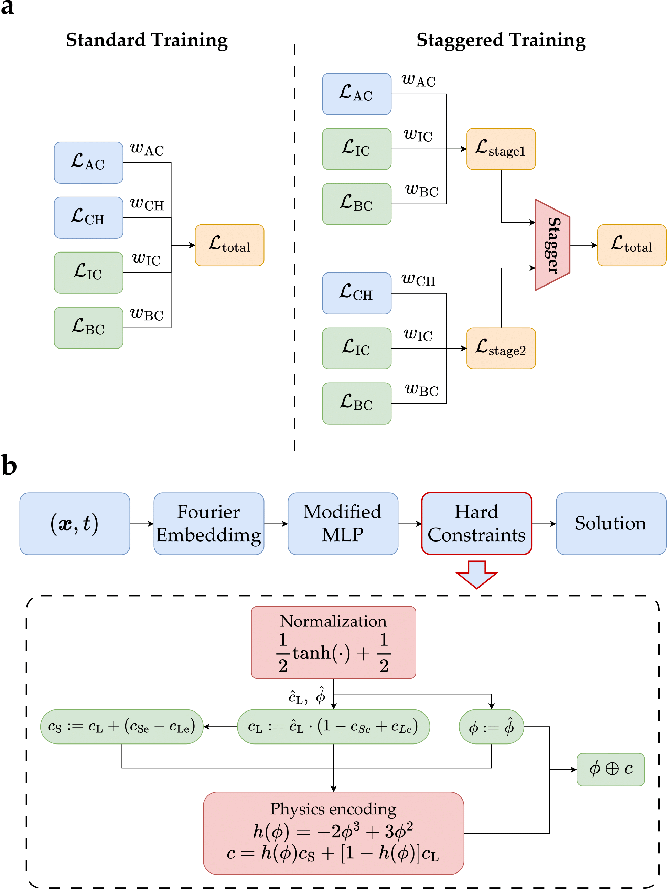
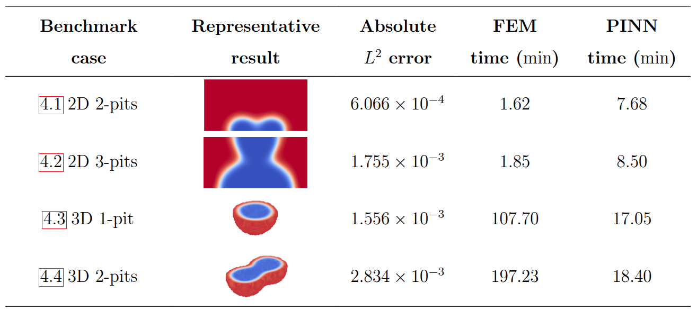

# SHARP-PINNs

Staggered HARd-constrained Physics-Informed Neural Networks for Phase-field modelling of corrosion

## Overview

This framework features a novel staggered training scheme and an enhanced neural network architecture. Key features of this architecture include leveraging random Fourier features $\mathcal{F}$ as input embeddings, employing a modified MLP $\mathcal{M}$ as the primary backbone, and enforcing hard constraints $\mathcal{H}$ in the output layer. A schematic of the SHARP-PINNs framework is shown below.

### Methodology




### State-of-the-art benchmarks




## Configurations

Recommended configurations for the 2D and 3D cases are provided below.

### 2d-1pit

```ini
[PARAM]
ALPHA_PHI = 1.03e-4
OMEGA_PHI = 1.76e7
MM = 7.94e-18
DD = 8.5e-10
AA = 5.35e7
LP = 2.0
CSE = 1.
CLE = 5100/1.43e5

[TRAIN]
DIM = 2
GEO_COEF = 1e4
TIME_COEF = 1e-1
TIME_SPAN = (0, 1.5)
GEO_SPAN = ((-0.5, 0.5), (0, 0.5))
IN_DIM = 256
HIDDEN_DIM = 128
OUT_DIM = 2
LAYERS = 6
NUM_CAUSAL_SEG = 10

BREAK_INTERVAL = 50
EPOCHS = 800000
LR = 5e-4

GEOTIME_SHAPE = [20, 20, 40]
BCDATA_SHAPE = 200
ICDATA_SHAPE = 400

RAR_BASE_SHAPE = 40000
RAR_SHAPE = 6000
RESUME = None

CAUSAL_WEIGHTING = True
SYMMETRIC = True

TARGET_TIMES = [0.000, 3.582, 8.190, 14.846]
MESH_POINTS = "./data/2d/mesh_points.npy"
REF_PREFIX = "./data/2d/sol-"
```


## 2d-2pits
```ini
[PARAM]
ALPHA_PHI = 1.03e-4
OMEGA_PHI = 1.76e7
MM = 7.94e-18
DD = 8.5e-10
AA = 5.35e7
LP = 2.0
CSE = 1.
CLE = 5100/1.43e5

[TRAIN]
DIM = 2
GEO_COEF = 1e4
TIME_COEF = 1e-1
TIME_SPAN = (0, 1.0)
GEO_SPAN = ((-0.5, 0.5), (0, 0.5))
IN_DIM = 256
HIDDEN_DIM = 200
OUT_DIM = 2
LAYERS = 6
NUM_CAUSAL_SEG = 32

BREAK_INTERVAL = 50
EPOCHS = 800000
LR = 5e-4

GEOTIME_SHAPE = [20, 20, 50]
BCDATA_SHAPE = 200
ICDATA_SHAPE = 500

RAR_BASE_SHAPE = 40000
RAR_SHAPE = 6000
RESUME = None
CAUSAL_WEIGHTING = True

HARD_CONSTRAIN = True
FOURIER_EMBEDDING = True
ARCH = "modifiedmlp"
SYMMETRIC = True


TARGET_TIMES = [0.000, 2.273, 4.803, 9.528,]
MESH_POINTS = "./data/2d-2pits/mesh_points.npy"
REF_PREFIX = "./data/2d-2pits/sol-"
```

## 2d-3pits
```ini
[PARAM]
ALPHA_PHI = 1.03e-4
OMEGA_PHI = 1.76e7
MM = 7.94e-18
DD = 8.5e-10
AA = 5.35e7
LP = 2.0
CSE = 1.
CLE = 5100/1.43e5

[TRAIN]
DIM = 2
GEO_COEF = 1e4
TIME_COEF = 1e-1
TIME_SPAN = (0, 1.0)
GEO_SPAN = ((-0.5, 0.5), (0, 0.5))
IN_DIM = 256
HIDDEN_DIM = 200
OUT_DIM = 2
LAYERS = 6
NUM_CAUSAL_SEG = 32

BREAK_INTERVAL = 20
EPOCHS = 800000
LR = 5e-4

GEOTIME_SHAPE = [20, 20, 50]
BCDATA_SHAPE = 200
ICDATA_SHAPE = 400

RAR_BASE_SHAPE = 40000
RAR_SHAPE = 6000
RESUME = None
CAUSAL_WEIGHTING = True

HARD_CONSTRAIN = True
FOURIER_EMBEDDING = True
ARCH = "modifiedmlp"
SYMMETRIC = True


TARGET_TIMES = [0.000, 1.988, 4.144,9.787]
MESH_POINTS = "./data/2d-3pits/mesh_points.npy"
REF_PREFIX = "./data/2d-3pits/sol-"
```


## 3d-1pit
```ini
[PARAM]
ALPHA_PHI = 1.03e-4
OMEGA_PHI = 1.76e7
MM = 7.94e-18
DD = 8.5e-10
AA = 5.35e7
LP = 2.0
CSE = 1.
CLE = 5100/1.43e5

[TRAIN]
DIM = 3
GEO_COEF = 1e4
TIME_COEF = 1e-1
TIME_SPAN = (0, 1.0)
GEO_SPAN = ((-0.4, 0.4), (-0.4, 0.4), (0, 0.4))
IN_DIM = 256
HIDDEN_DIM = 128
OUT_DIM = 2
LAYERS = 4
NUM_CAUSAL_SEG = 20

BREAK_INTERVAL = 50
EPOCHS = 800000
LR = 1e-3

GEOTIME_SHAPE = [20, 20, 15, 30]
BCDATA_SHAPE = 200
ICDATA_SHAPE = 400

RAR_BASE_SHAPE = 40000
RAR_SHAPE = 6000
RESUME = None
CAUSAL_WEIGHTING = False

HARD_CONSTRAIN = True
FOURIER_EMBEDDING = True
ARCH = "modifiedmlp"
SYMMETRIC = False

TARGET_TIMES = [0.000, 1.968, 6.401, 9.357]
MESH_POINTS = "./data/3d/mesh_points.npy"
REF_PREFIX = "./data/3d/sol-"
```


## 3d-2pit
```ini
[PARAM]
ALPHA_PHI = 1.03e-4
OMEGA_PHI = 1.76e7
MM = 7.94e-18
DD = 8.5e-10
AA = 5.35e7
LP = 2.0
CSE = 1.
CLE = 5100/1.43e5

[TRAIN]
DIM = 3
GEO_COEF = 1e4
TIME_COEF = 1e-1
TIME_SPAN = (0, 1.0)
GEO_SPAN = ((-0.6, 0.6), (-0.3, 0.3), (0, 0.3))
IN_DIM = 256
HIDDEN_DIM = 128
OUT_DIM = 2
LAYERS = 4
NUM_CAUSAL_SEG = 10

BREAK_INTERVAL = 50
EPOCHS = 20000
LR = 5e-4

GEOTIME_SHAPE = [25, 15, 15, 30]
BCDATA_SHAPE = 200
ICDATA_SHAPE = 400

RAR_BASE_SHAPE = 30000
RAR_SHAPE = 5000
RESUME = None
CAUSAL_WEIGHTING = False

HARD_CONSTRAIN = True
FOURIER_EMBEDDING = True
ARCH = "modifiedmlp"
SYMMETRIC = False


TARGET_TIMES = [0.000, 1.311, 3.938, 9.521]
MESH_POINTS = "./data/3d-2pits/mesh_points.npy"
REF_PREFIX = "./data/3d-2pits/sol-"
```
